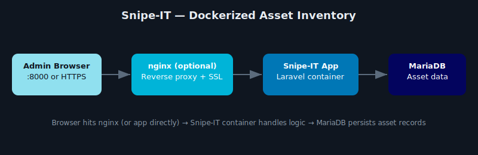

# 📦 Snipe-IT Docker Deployment (Ubuntu 24.04)

  

This repository provides a clean and reliable installation guide for deploying [Snipe-IT](https://snipeitapp.com) using Docker and Docker Compose on Ubuntu 24.04.



## 📄 Installation Guide

For full step-by-step instructions, refer to the [SnipeIT_Install_Guide](./SnipeIT_Install_Guide.md) in this repository.

## 🧰 Features

- Dockerized Snipe-IT and MariaDB
- Laravel `.env` configuration
- Secure key generation
- Web interface setup wizard

## 🚀 Quick Start

```bash
wget https://raw.githubusercontent.com/snipe/snipe-it/master/install.sh
chmod +x install.sh
./install.sh
```

Then follow the steps in the full guide.

## 🔒 Security Tip

Always verify that your `.env` file is not publicly accessible via the web.

## 📄 License

This project is licensed under the MIT License. See [LICENSE](./MIT%20License.txt) for details.
